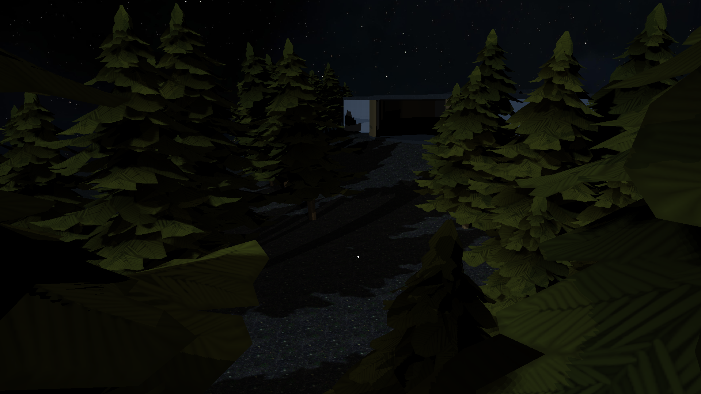

# OpenGL Renderer

A OpenGL renderer that supports loading `.obj` models and implements lighting techniques, including **Blinn-Phong shading**, **shadow mapping**, and **omnidirectional shadow mapping**.

  

---

### Prerequisites

- **Windows OS**  
- **Visual Studio 2022**

### How to Build

1. Clone the repository to your local machine:
   ```bash
   git clone https://github.com/eliasfuericht/OpenGL-Renderer.git
2. Open .sln file in root directory
3. Hit run in Visual Studio
